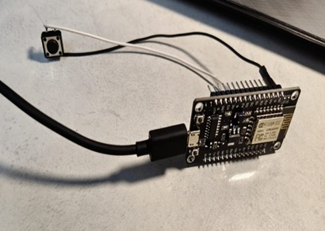

# Women Safety Band

## 📌 Project Overview

The Women Safety Band is a smart wearable device designed to improve women's safety during emergency situations. The band can help the user send an emergency alert and share their location with trusted contacts.

## 🎯 Objectives

- To provide quick emergency assistance.
- To send alerts during dangerous situations.
- To improve personal safety using technology.
- To create a portable and easy-to-use safety device.

## 🛠️ Technologies Used

- Arduino / Microcontroller
- GPS Module
- GSM Module
- Emergency Button
- Sensors
- Embedded C / Arduino IDE

## ⚙️ How It Works

1. The user presses the emergency button.
2. The system detects the emergency.
3. The GPS module obtains the location.
4. The GSM module sends an alert message.
5. The trusted contact receives the emergency information.

## 📁 Project Structure

- `Arduino_Code/` – Source code
- `Circuit_Diagram/` – Circuit diagrams
- `Images/` – Project photographs
- `Documentation/` – Project report

## 🌍 Social Impact

This project aims to provide women with a simple, portable, and technology-based safety solution during emergency situations.

## 👩‍💻 Team Members

- Lekhana
- Yashaswini 
- Tejas.S.R
- Varsha
- Keerthi

# project code used 
               Transmitter
#include <ESP8266WiFi.h>

extern "C" {
#include <espnow.h>
}

typedef struct {
  int buttonState;
} Message;

Message data;

// Receiver MAC Address
uint8_t receiverMAC[] = {0xC8, 0x2B, 0x96, 0x22, 0x89, 0x22};

void OnDataSent(uint8_t *mac_addr, uint8_t sendStatus)
{
  Serial.print("Send Status: ");
  Serial.println(sendStatus == 0 ? "Success" : "Fail");
}

void setup()
{
  Serial.begin(115200);

  pinMode(D2, INPUT_PULLUP);

  WiFi.mode(WIFI_STA);

  if (esp_now_init() != 0)
  {
    Serial.println("ESP-NOW Init Failed");
    return;
  }

  esp_now_set_self_role(ESP_NOW_ROLE_CONTROLLER);

  esp_now_register_send_cb(OnDataSent);

  esp_now_add_peer(receiverMAC,
                   ESP_NOW_ROLE_SLAVE,
                   1,
                   NULL,
                   0);
}

void loop()
{
  data.buttonState = !digitalRead(D2);

  esp_now_send(receiverMAC,
               (uint8_t *)&data,
               sizeof(data));

  Serial.print("Sent: ");
  Serial.println(data.buttonState);

  delay(500);
}
       

#include <ESP8266WiFi.h>

extern "C" {
#include <espnow.h>
}

typedef struct {
  int buttonState;
} Message;

Message data;

// Callback when data is received
void receiveData(uint8_t *mac, uint8_t *incomingData, uint8_t len)
{
  memcpy(&data, incomingData, sizeof(data));

  Serial.print("Received: ");
  Serial.println(data.buttonState);

  // Built-in LED is ACTIVE LOW
  if (data.buttonState == 1)
  {
    digitalWrite(LED_BUILTIN, LOW);   // LED ON
  }
  else
  {
    digitalWrite(LED_BUILTIN, HIGH);  // LED OFF
  }
}

void setup()
{
  Serial.begin(115200);

  pinMode(LED_BUILTIN, OUTPUT);
  digitalWrite(LED_BUILTIN, HIGH);

  WiFi.mode(WIFI_STA);

  if (esp_now_init() != 0)
  {
    Serial.println("ESP-NOW Init Failed");
    return;
  }

  esp_now_set_self_role(ESP_NOW_ROLE_SLAVE);

  esp_now_register_recv_cb(receiveData);

  Serial.println("Receiver Ready");
}

void loop()
{
}

receiver code
## 📸 Project Images
### Sender Unit

### Receiver Unit

